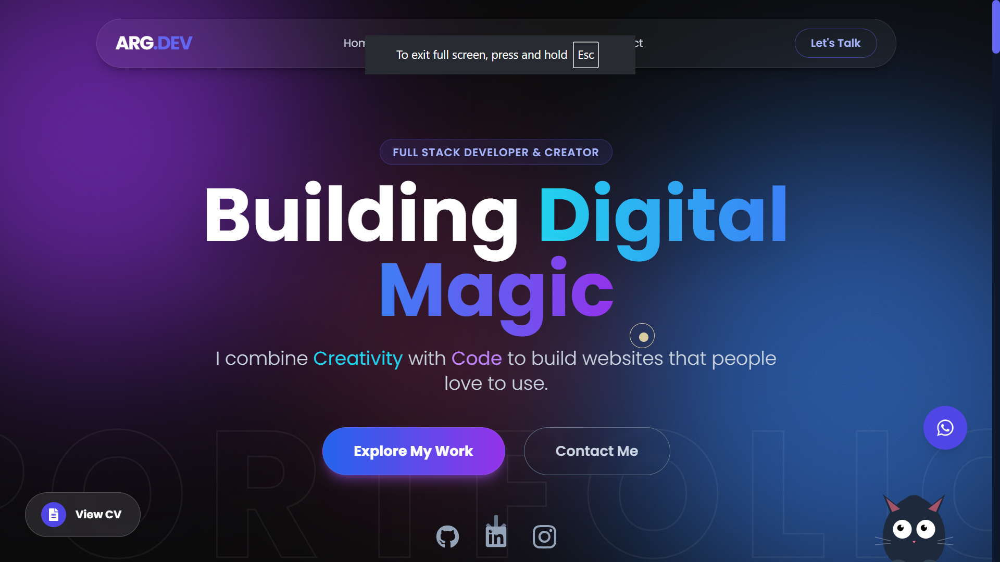

# ArgCoding — Personal Portfolio Website 🚀

ArgCoding is my personal developer portfolio website built to showcase my work, skills, and services as a Full Stack Developer.
The website highlights my projects, development expertise, and provides a way for clients or companies to connect with me for job, internship, or freelance opportunities.

---

## 🌐 Live Website

**Portfolio:**
https://argcoding.vercel.app/

---

## ✨ Features

• Modern responsive design (mobile-first)
• Smooth animations and interactive UI
• Scroll-based project showcase
• Project cards with live demo & GitHub links
• Sticky sections and animated components
• Clean and minimal user experience
• Contact section for business or hiring inquiries

---

## 🧠 What This Website Demonstrates

This portfolio demonstrates my ability to:

• Build modern web interfaces with React
• Create smooth UI animations using Framer Motion
• Design responsive layouts using Tailwind CSS
• Structure scalable frontend projects
• Optimize user experience and performance

---

## 🛠️ Tech Stack

Frontend
• React.js
• Tailwind CSS
• JavaScript (ES6+)

Animation & UI
• Framer Motion
• CSS animations
• Scroll-based interactions

Tools
• Vite
• Git & GitHub
• VS Code

---

## 📂 Featured Projects

### 1. Politician Portfolio Website

A modern responsive portfolio site with SEO optimization and contact form integration.

### 2. Designer QR Generator

A futuristic web application for generating stylish, branded QR codes with a dark-mode UI.

### 3. HabitQuest — Gamified Habit Tracker

A productivity app that gamifies daily habits using quests, XP, and leveling mechanics.

### 4. CareerPath India

A career guidance platform designed to help students explore professional paths and education options.

---

## 📸 Website Preview




---

## 🚀 Getting Started

To run this project locally:

```bash
git clone https://github.com/argtiwari/argcoding.git

cd argcoding

npm install

npm run dev
```

---

## 📬 Contact

If you want to collaborate, hire me, or discuss a project:

Email: [argtiwary11gmail.com](mailto:argtiwary11gmail.com)
Portfolio: https://argcoding.vercel.app/
GitHub: https://github.com/argtiwari

---

## 💡 About ArgCoding

ArgCoding is my personal brand where I build modern websites and web applications for startups, businesses, and individuals.

My goal is to create clean, fast, and engaging web experiences that help people and businesses grow online.

---

⭐ If you like this project, consider giving it a star on GitHub.
